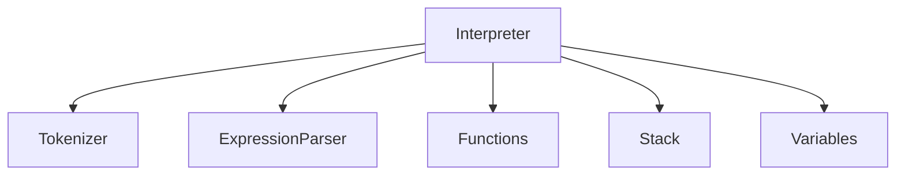
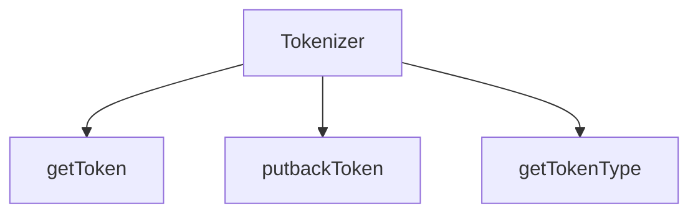
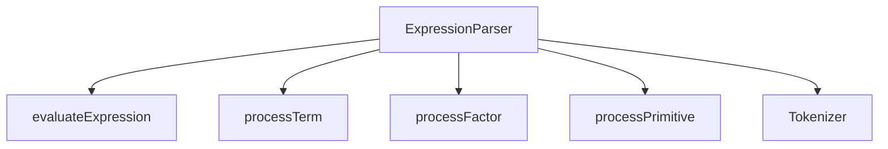
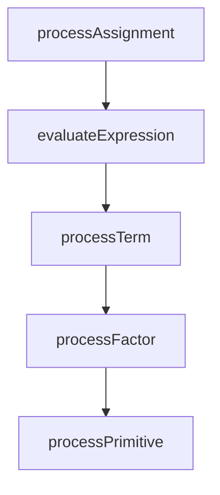
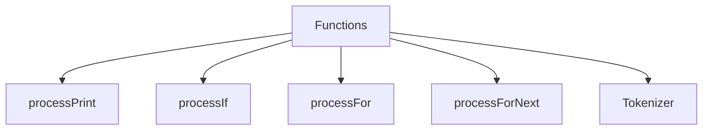
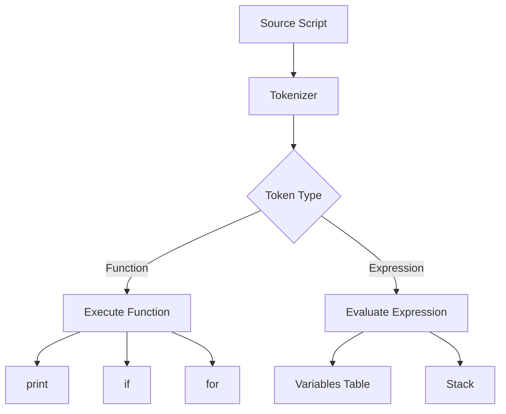

# Small Language Interpreter (JavaScript Implementation)

An experimental project that demonstrates how a simple programming language interpreter can be implemented in JavaScript. The codebase is intentionally kept concise, with minimal error handling, to highlight the core interpreter concepts—tokenization, parsing, and execution—without unnecessary complexity.

This project was developed around **2016–2017** as part of early exploration into **compiler and interpreter design**.

---

## Live Demo

👉 https://avilanorwin.github.io/small-language-interpreter-js-implementation/

> Open the link and try the sample script below.

---

## Overview

This interpreter processes a custom scripting language using a **top-down design approach**:

1. Tokenization  
2. Parsing (BNF-based)  
3. Execution  

Supported features:
- Variables (A–Z, case insensitive)
- Arithmetic expressions
- `print`
- `if`
- `for`

---

## Interpreter Design Diagrams

### 🔹 Overall Top-down Design



---

### Tokenizer Module



---

### Expression Parser Module



---

### Expression Evaluation Flow



---

### Functions Module



---

### Script Processing Flow



---

## Language Specification

### Variables
Use single-letter variables, case insensitive. The interpreter supports up to 26 variables (A–Z).

Example:
```
A = 100;
```

---

### Functions

Supports only 3 functions:

#### print
```
print "Hello, world";
print <variable>;
print <variable>, <string>, ...
```

---

#### for
```
for (i = <initial value> to <limit>) {
    <expression>;
    <statement>;
}
```

Example:
```
for (i = 0 to 5) {
    print "value of i: ", i;
}
```

---

#### if
```
if (<expression>) {
    <expression>;
    <statement>;
}
```

Supported operators:
```
=, <, >
```

---

### Error Handling

The interpreter does not implement robust error checking in order to keep the code small and focused. If a syntax error is encountered, behavior is undefined and may cause unresponsiveness.

---

## Execution Flow

1. Tokenize the script:
   - Function
   - Quoted string
   - Variable
   - Expression  

2. Execute function if encountered (`print`, `if`, `for`)

3. Evaluate expressions:
   - Variable assignment  
   - Conditional logic  
   - Mathematical expressions  

4. Uses:
   - Stack  
   - Variable table  

---

## Try Sample Script

Paste this into the live demo:

```
print "This script prints hello world 10 times";

for (i = 1 to 10) {
    print i, "Hello world!";
}

A = 5;
B = 10;

if (A < B) {
    print "A is less than B";
}
```

---

## Run Locally

```
git clone https://github.com/avilanorwin/small-language-interpreter-js-implementation.git
cd small-language-interpreter-js-implementation
open index.html
```

---

## Key Concepts Demonstrated

- Tokenization  
- Recursive descent parsing  
- Expression evaluation  
- Control flow implementation  
- Stack-based execution  

---

## Historical Context

This project represents an early-stage exploration into interpreter design and language processing.

