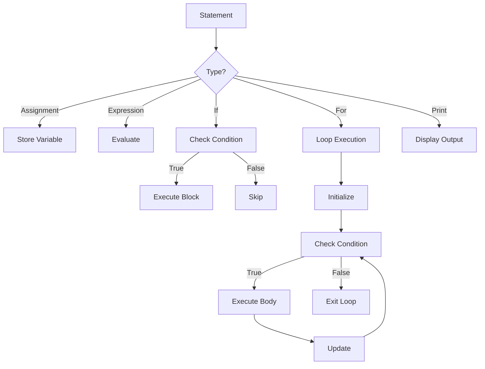

# Small Language Interpreter Implemented in Javascript

An experimental project that explores how a simple programming language interpreter can be built using JavaScript. To keep the implementation concise and focused, extensive error handling is intentionally minimized, allowing readers to better understand the core concepts of tokenization, parsing, and execution without unnecessary complexity.

This project was developed around **2016–2017** as part of my early exploration into **compiler and interpreter design**, focusing on tokenization, parsing, and execution.

> This implementation follows a **BNF-based language design** and uses a **recursive descent parsing approach**.

---

## Live Demo

https://avilanorwin.github.io/small-language-interpreter-js-implementation/

> No installation required — just open the page and start writing scripts.

---

## Project Objective

The goal of this project is to demonstrate how a simple programming language can be:

1. Defined using formal grammar (BNF)  
2. Parsed into structured instructions  
3. Executed using a custom interpreter engine  

---

## System Architecture

```mermaid
flowchart TD
    A[User Input Script] --> B[Tokenizer]
    B --> C[Parser (BNF Rules)]
    C --> D[Interpreter Engine]
    D --> E[Output Display]
```

---

## Execution Flow



---

## Language Design (BNF-Based)

```bnf
<program>        ::= <statement_list>

<statement_list> ::= <statement> | <statement> <statement_list>

<statement>      ::= <assignment>
                   | <if_statement>
                   | <for_statement>
                   | <print_statement>

<assignment>     ::= <identifier> "=" <expression>

<if_statement>   ::= "if" "(" <expression> ")" "{" <statement_list> "}"

<for_statement>  ::= "for" "(" <assignment> ";" <expression> ";" <assignment> ")" 
                     "{" <statement_list> "}"

<print_statement>::= "print" "(" <expression> ")"
```

---

## Components

- tokenizer.js → token generation  
- expression_parser.js → BNF parser  
- interpreter.js → execution engine  
- functions.js → built-in functions  

---

## Try Sample Script

```
a = 5
b = 10

print(a)
print(b)

if (a < b) {
    print(100)
}

for (i = 0; i < 5; i = i + 1) {
    print(i)
}

for (i = 0; i < 5; i = i + 1) {
    if (i == 0) { print(i) }
    if (i == 2) { print(i) }
    if (i == 4) { print(i) }
}
```

### Expected Output

```
5
10
100
0
1
2
3
4
0
2
4
```

---

## Run Locally

```
git clone https://github.com/avilanorwin/norwin-bnf-interpreter.git
cd norwin-bnf-interpreter/src
open index.html
```
